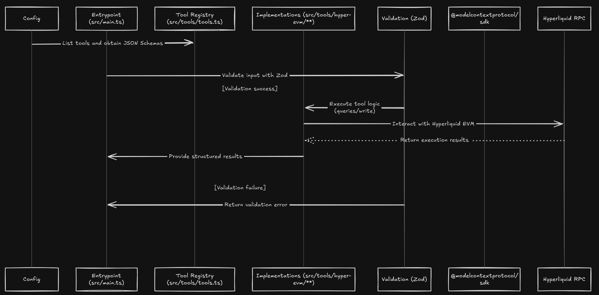

### Introduction

Nexus is a Model Context Protocol (MCP) server that makes a set of blockchain tools available for the Hyperliquid EVM chain through a standard tool interface. It lets AI agents and clients that work with MCP safely query the state of the chain and do things on-chain through validated tool calls.

### What is an MCP server?

A Model Context Protocol (MCP) server is an open standard for connecting AI agents to external tools and data.

An MCP server:

- Provides a list of tools with JSON schemas for inputs/outputs
- Communicates over stdio or network transports
- Handles requests like "list tools" and "call tool" in a consistent, typed manner

### How it Eases Workflow

MCP servers offer a schema-driven interface that removes the need for custom integrations. Tools are easy for agents to discover, validate, and call, whether running locally (stdio) or remotely (network).

### Benefits

- **Interoperability** – Works with any MCP-compliant client
- **Scalability** – Add or update tools without reworking integrations
- **Reliability** – Typed schemas reduce runtime errors

### Why Hyperliquid?

- High-performance EVM environment with fast finality and low fees
- Familiar EVM tooling (ABIs, RPC, wallets) via `viem`

## Architecture

Below is the complete architecture of Nexus



## Implemented tools

The server currently exposes the following tools (see `src/tools/tools.ts`):

- get_latest_block: Get the latest block number
- get_balance: Get native token balance for a user address
- get_token_balance: Get ERC-20 token balance for a user address
- send_funds: Send native funds from the configured signer to a receiver
- deploy_contracts: Deploy a contract with ABI, bytecode, constructor args
- get_transaction_receipt: Fetch a transaction receipt by hash

Each tool validates inputs with `zod` and executes using `viem` on the configured Hyperliquid RPC.

## Tools in progress

- call_function: Call the function of a contract
- fetch_transactions: Fetch the transactions for a user address
- fetch_orders: Fetch the historical orders for a user address

## Getting started

### Prerequisites

- Node.js 18+
- An RPC endpoint for Hyperliquid EVM
- A funded private key for actions that require signing (e.g., send funds, deploy)

### Installation

```bash
npm install
```

### Configuration

Create a `.env` file in the project root with:

```bash
CHAIN_ID=998,
CHAIN_RPC_URL=https://hyperliquid-testnet.drpc.org,
BLOCK_EXPLORER_URL=https://testnet.purrsec.com/,
IS_TESTNET=true,
PRIVATE_KEY=0x...
```

The server uses `src/config.ts` to define the chain and to create a `viem` wallet client from these values.

### Build and run

```bash
npm run build
npm start
```

You should see: "Hyperliquid MCP Server running on stdio".

## Using the server from an MCP client

Any MCP-compatible client can:

1. List tools
2. Call tools with JSON arguments that match the advertised schemas

Example tool calls (names only; argument shapes are defined by the server):

- get_latest_block
- get_balance { userAddress }
- get_token_balance { contractAddress, userAddress }
- send_funds { receiverAddress, amountToSend }
- deploy_contracts { abi, bytecode, constructorArguments }
- get_transaction_receipt { txHash }

Inspect `src/main.ts` and `src/tools/**` for exact schemas and behaviors.

## Development

- Build: `npm run build`
- Dev: `npm run dev`
- Lint: `npm run lint`
- Format: `npm run format`

## Project structure

```
src/
  main.ts                 # MCP server bootstrap and handlers
  client.ts               # viem wallet client configured from env
  config.ts               # chain configuration (Hyperliquid EVM)
  tools/                  # tool definitions and implementations
    tools.ts              # Tool metadata + schemas for MCP
    hyper-evm/            # EVM-specific tool implementations
```

## Team

- [Harrish](https://github.com/Haxry)
- [Veer](https://github.com/VeerChaurasia)
- [Akshat](https://github.com/dev-n-dough)
- [Abhivansh](https://github.com/akronim26)
- [Yash](https://github.com/YASH-ai-bit)
- [Yogita](https://github.com/yogitagoel)
- [Rishi](https://github.com/rishi-tal-12)
- [Soham](https://github.com/0xr10t)

## Contributing

We openly welcome contributions to Nexus from the broader web3 community. For details, refer -[CONTRIBUTION GUIDELINES](CONTRIBUTING.md).
